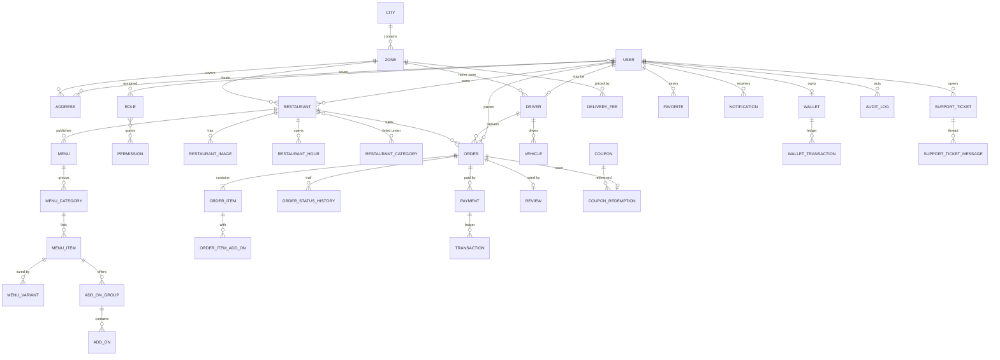

# ZassDelivery API

Food delivery platform backend serving **Pabbi**, **Nowshera** and **Peshawar**, Pakistan.

Built with NestJS 11, PostgreSQL 16 + Prisma, Redis, and TypeScript in strict mode.

---

## Status

| Milestone | Scope                                                                                               | State       |
| --------- | --------------------------------------------------------------------------------------------------- | ----------- |
| **1**     | Foundation: config, Docker, Prisma, Redis, logging, error handling, pagination, health, Swagger, CI | ✅ Complete |
| 2         | Auth & identity — phone + OTP, JWT access/refresh, RBAC                                             | Planned     |
| 3         | Users & addresses                                                                                   | Planned     |
| 4         | Vendors & catalog                                                                                   | Planned     |
| 5         | Cart & pricing                                                                                      | Planned     |
| 6         | Orders                                                                                              | Planned     |
| 7         | Dispatch & riders (Socket.IO)                                                                       | Planned     |
| 8         | Payments (COD, wallet, JazzCash/Easypaisa)                                                          | Planned     |
| 9         | Notifications, ratings, admin analytics                                                             | Planned     |

---

## Requirements

- **Node.js** ≥ 20.11 (developed on 24.x)
- **Docker** & Docker Compose
- **npm** 11+

---

## Quick start

```bash
# 1. Configure the environment
cp .env.example .env

# 2. Start PostgreSQL and Redis
npm run docker:up

# 3. Install dependencies
npm install

# 4. Generate the Prisma client and create the schema
npm run prisma:generate
npm run prisma:deploy

# 5. Load reference data (cities, zones, seed accounts)
npm run prisma:seed

# 6. Run the API in watch mode
npm run start:dev
```

| Resource   | URL                                 |
| ---------- | ----------------------------------- |
| API base   | http://localhost:3000/api/v1        |
| Swagger UI | http://localhost:3000/api/docs      |
| Health     | http://localhost:3000/api/v1/health |

### Port note

`docker-compose.yml` publishes PostgreSQL on **5433**, not 5432, because many
machines already run a local PostgreSQL on the default port — and connecting to
the wrong one produces a confusing authentication error. Change `POSTGRES_PORT`
and the port in `DATABASE_URL` together if you prefer 5432.

Inside the Compose network the port is always 5432; the `api` service overrides
`DATABASE_URL` and `REDIS_HOST` accordingly.

---

## Running the whole stack in Docker

```bash
docker compose up -d --build
docker compose logs -f api
```

The API image applies pending migrations on boot via `docker-entrypoint.sh`
(`prisma migrate deploy`, which is idempotent and never resets data). Set
`RUN_MIGRATIONS_ON_BOOT=false` to disable that in environments where migrations
are applied by a separate release step.

---

## Testing

```bash
npm run test          # unit tests
npm run test:cov      # unit tests with coverage
npm run test:e2e      # end-to-end (requires Postgres + Redis running)
npm run lint          # ESLint
npm run typecheck     # tsc --noEmit
npm run format:check  # Prettier
```

Unit specs live beside the code they cover (`*.spec.ts`). End-to-end specs live
in `test/` and boot the real application graph against live PostgreSQL and
Redis, so they run serially.

---

## Architecture

Clean Architecture, organised by feature. Each feature module separates:

```
src/modules/<feature>/
├── domain/          # Entities, value objects, repository interfaces (no framework imports)
├── application/     # Use-cases, DTOs — orchestration only
└── infrastructure/  # Prisma repositories, external adapters
```

Dependencies point inward: infrastructure depends on domain, never the reverse.
Repository interfaces are declared in `domain/` and bound to Prisma
implementations in the module definition, which keeps use-cases testable with
plain in-memory fakes.

```
src/
├── common/          # Cross-cutting: filters, interceptors, DTOs, decorators, context
│   └── common.module.ts    # Registers the global request pipeline
├── config/          # Namespaced, validated configuration
├── infrastructure/  # Prisma (database), Redis and Winston wiring
├── shared/
│   └── shared.module.ts    # Aggregates database + cache + logger for features
└── modules/         # Feature modules
```

**`SharedModule`** bundles the backing services a feature needs (database,
cache, logger) so a feature module imports one thing instead of three.
**`CommonModule`** owns the request pipeline — filters, interceptors, guard and
middleware. `AppModule` therefore only lists _what the application contains_,
not _how a request is handled_.

`PrismaModule` is the database module; the name reflects the driver, and
replacing it would be a change confined to `SharedModule`.

### Cross-cutting behaviour

Every request passes through the same pipeline, so features do not re-implement it:

| Concern        | Mechanism                                                                   |
| -------------- | --------------------------------------------------------------------------- |
| Correlation id | `RequestContextMiddleware` + `AsyncLocalStorage`, echoed as `x-request-id`  |
| Validation     | Global `ValidationPipe` (`whitelist`, `forbidNonWhitelisted`, `transform`)  |
| Errors         | `AllExceptionsFilter` — one envelope, Prisma codes mapped to HTTP semantics |
| Success shape  | `ResponseInterceptor` — uniform envelope, pagination meta hoisted           |
| Access logs    | `LoggingInterceptor` → Winston, correlated and redacted                     |
| Timeouts       | `TimeoutInterceptor` (15s default)                                          |
| Rate limiting  | `ThrottlerGuard`                                                            |

### Response format

Success:

```json
{
  "success": true,
  "statusCode": 200,
  "message": "OK",
  "data": {},
  "meta": {
    "total": 137,
    "page": 1,
    "limit": 20,
    "totalPages": 7,
    "hasPreviousPage": false,
    "hasNextPage": true
  },
  "requestId": "3f1c0b2e-9d5a-4b3e-8f1a-2c7d6e5b4a39",
  "timestamp": "2026-08-04T09:12:33.412Z"
}
```

`meta` is present only on paginated list endpoints.

Error:

```json
{
  "success": false,
  "statusCode": 409,
  "error": "Conflict",
  "message": "A record with this phone already exists.",
  "errorCode": "UNIQUE_CONSTRAINT_VIOLATION",
  "path": "/api/v1/users",
  "requestId": "3f1c0b2e-9d5a-4b3e-8f1a-2c7d6e5b4a39",
  "timestamp": "2026-08-04T09:12:33.412Z"
}
```

`errorCode` is stable and machine-readable — branch on it rather than on
`message`. Validation failures add a `details` array of field errors.

Health probes are deliberately exempt from both envelopes and return Terminus'
native format, on success and on failure alike.

---

## Data model

42 tables across seven domains. `User` and `Order` are the two hubs: almost
every table reaches one of them within a single hop.



### Domains

| Domain            | Tables                                                                                                             |
| ----------------- | ------------------------------------------------------------------------------------------------------------------ |
| Identity & access | `users`, `roles`, `permissions`, `role_permissions`, `user_role_assignments`                                       |
| Geography         | `cities`, `zones`, `delivery_fees`, `addresses`                                                                    |
| Restaurants       | `restaurants`, `restaurant_categories`, `restaurant_category_assignments`, `restaurant_images`, `restaurant_hours` |
| Menu              | `menus`, `menu_categories`, `menu_items`, `menu_variants`, `add_on_groups`, `add_ons`                              |
| Delivery          | `drivers`, `vehicles`                                                                                              |
| Orders            | `orders`, `order_items`, `order_item_add_ons`, `order_status_history`                                              |
| Money             | `payments`, `transactions`, `wallets`, `wallet_transactions`, `coupons`, `coupon_redemptions`                      |
| Engagement        | `favorites`, `reviews`, `notifications`                                                                            |
| Operations        | `support_tickets`, `support_ticket_messages`, `audit_logs`                                                         |
| Content           | `banners`, `settings`, `faqs`                                                                                      |

### Design rules

- **Money** is `Decimal(10,2)` (`Decimal(12,2)` for wallet and ledger balances);
  **coordinates** are `Float`. Never store currency as a float.
- All timestamps are `Timestamptz(3)`.
- **Orders snapshot everything they depend on** — item names, variant names,
  unit prices, the delivery address and the coupon code. Menus and addresses
  change constantly; a historical order must not change with them. Foreign keys
  to menu items are `SetNull`, so deleting a dish never rewrites past orders.
- **Ledgers are append-only.** `transactions` and `wallet_transactions` are never
  updated; corrections are posted as new rows. `transactions.reference` is unique,
  which makes a replayed gateway webhook a no-op instead of a double credit.
- **Denormalised aggregates** (`restaurants.rating`, `drivers.rating`,
  `orders.paymentStatus`) exist because listings sort and filter on them; they are
  recomputed on write rather than joined on every read.
- `User`, `Address`, `Restaurant`, `MenuItem` and `Driver` are **soft-deleted**
  via `deletedAt`; read paths must filter it.

### Constraints and indexes beyond Prisma's schema language

Hand-written in `20260804053000_full_platform_schema`, because the schema
language cannot express them:

- **18 CHECK constraints** — order totals must equal their components; ratings
  must be 1–5; percentage coupons cannot exceed 100%; add-on `minSelect` must not
  exceed `maxSelect`; a favorite must reference exactly one target; money is
  never negative. The application validates these too, but a constraint is what
  holds under concurrent writes and manual SQL.
- **GIN trigram indexes** on `restaurants.name`, `menu_items.name`,
  `users.full_name` and `users.phone`, backing `?search=`. A btree index cannot
  serve a leading-wildcard `ILIKE '%term%'`.
- **Partial indexes** on the hot paths: browsable restaurants, orderable menu
  items, dispatchable riders, in-flight orders, unread notifications — plus
  partial _unique_ indexes for one default address per user and one primary
  vehicle per driver.

> Prisma cannot represent trigram indexes in the datamodel, so `migrate diff`
> proposes dropping them on every run. Strip those `DROP INDEX` lines when
> generating a new migration.

### Seeded data

| Phone           | Role                                                    |
| --------------- | ------------------------------------------------------- |
| `+923000000001` | `SUPER_ADMIN` (all 51 permissions)                      |
| `+923000000002` | `ADMIN`                                                 |
| `+923001234567` | `CUSTOMER` — default Pabbi address, one delivered order |
| `+923009876543` | `RIDER` — motorcycle `PES-4821`                         |
| `+923005551234` | `VENDOR_OWNER` — Chapli Kabab House                     |

Also seeded: 6 roles · 51 permissions · 3 cities · 9 zones · 27 delivery-fee
bands · 3 restaurants with menus · 10 menu items · 3 coupons · 10 settings ·
5 FAQs · and one fully delivered order with its payment, ledger entries, wallet
movement, review and notification.

The seed is idempotent — every write is an upsert on a natural key.

---

## Configuration

All environment variables are declared in `src/config/env.validation.ts` and
validated at boot. A malformed environment **aborts startup** with every problem
listed at once, rather than failing later at the first request that needs the
value. See `.env.example` for the full set.

Configuration is exposed as typed namespaces:

```ts
constructor(
  @Inject(appConfig.KEY) private readonly config: ConfigType<typeof appConfig>,
) {}
```

---

## Database workflow

```bash
npm run prisma:migrate   # create + apply a migration in development
npm run prisma:deploy    # apply pending migrations (non-interactive; CI/production)
npm run prisma:studio    # browse data
npm run db:reset         # DESTRUCTIVE: drop, re-migrate, re-seed
```

Use `prisma:deploy` in any script or pipeline. `prisma migrate dev` is
interactive and can block waiting for input.

---

## Version pins

Some dependencies are deliberately held back from the newest release:

- **Prisma 6.19.3** — Prisma 7 requires a new `prisma.config.ts` and no longer
  auto-loads `.env`. Deferred until the migration is scheduled deliberately.
- **TypeScript 5.9.3** — `ts-jest` requires `typescript >=4.3 <7`; TypeScript 7
  would break the test toolchain.
- **ioredis 5.11.1** — 6.0.0 is a very recent major on critical infrastructure.

`package.json` also carries an `allowScripts` block. npm 11 blocks install
scripts by default; Prisma's engine download is one of them, so the approval is
committed to keep local, CI and Docker installs identical.

---

## Git hooks

Husky installs on `npm install` via the `prepare` script.

| Hook         | Action                                                           |
| ------------ | ---------------------------------------------------------------- |
| `pre-commit` | `lint-staged` — ESLint `--fix` and Prettier on staged files only |
| `commit-msg` | `commitlint` — enforces Conventional Commits                     |

Commit messages must follow `type(scope): subject`, for example:

```
feat(auth): add phone OTP verification
fix(orders): correct delivery fee for Risalpur zone
```

Allowed types: `feat`, `fix`, `docs`, `style`, `refactor`, `perf`, `test`,
`build`, `ci`, `chore`, `revert`. This keeps automated changelogs and semantic
version bumps possible without rewriting history later.

The hooks intentionally do **not** run the full test suite — a slow commit is a
bypassed commit. CI owns tests, typecheck and the build.

---

## Graceful shutdown

On `SIGTERM`/`SIGINT` the application stops accepting connections, lets in-flight
requests finish, then closes Prisma and Redis through their `onModuleDestroy`
hooks. A failsafe timer (`shutdownTimeoutMs`, default 10s) forces exit if a hung
dependency would otherwise leave the container un-killable.

HTTP keep-alive is set to 65s — longer than a typical load balancer idle timeout,
so the balancer cannot reuse a socket the server is already closing and surface
sporadic 502s.

---

## CI

`.github/workflows/ci.yml` runs three jobs on every push and pull request:

1. **quality** — format check, lint, typecheck, unit tests with coverage
2. **e2e** — end-to-end suite against service containers for PostgreSQL and Redis
3. **build** — compile, then build the production Docker image
