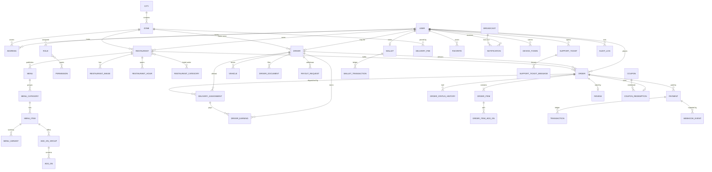

# ZassDelivery API

Food delivery platform backend serving **Pabbi**, **Nowshera** and **Peshawar**, Pakistan.

Built with NestJS 11, PostgreSQL 16 + Prisma, Redis, and TypeScript in strict mode.

---

## Status

| Milestone | Scope                                                                                               | State       |
| --------- | --------------------------------------------------------------------------------------------------- | ----------- |
| **1**     | Foundation: config, Docker, Prisma, Redis, logging, error handling, pagination, health, Swagger, CI | ✅ Complete |
| **2**     | Auth & identity — register/login, JWT access + rotating refresh, RBAC, permissions                  | ✅ Complete |
| **3**     | Users — admin CRUD, profile, addresses, favorites, notification preferences                         | ✅ Complete |
| **4**     | Restaurants — registration, approval workflow, hours, radius, categories, images, search            | ✅ Complete |
| **5**     | Menus — categories, items, variants, extra options, availability, images, inventory, bulk update    | ✅ Complete |
| **6**     | Search — full-text, food, category, nearby, trending, popular, autocomplete, Redis cache            | ✅ Complete |
| **7**     | Cart & pricing — add/remove/update, coupons, delivery fee, tax, discount, validation                | ✅ Complete |
| **8**     | Orders — placement, lifecycle state machine, timeline, refunds, invoice, transactions               | ✅ Complete |
| **9**     | Riders — onboarding, documents, approval, dispatch, delivery OTP, earnings, wallet, withdrawals     | ✅ Complete |
| **10**    | Payments — COD, JazzCash, Easypaisa, verification, webhooks, refunds, invoices, ledger              | ✅ Complete |
| **11**    | Notifications — FCM push, device registry, history, preferences, admin broadcasts                   | ✅ Complete |
| 12        | Ratings and admin analytics                                                                         | Planned     |
| 13        | Live tracking over Socket.IO                                                                        | Planned     |

---

## Requirements

- **Node.js** ≥ 20.11 (developed on 24.x)
- **Docker** & Docker Compose
- **npm** 11+

---

## Quick start

```bash
# 1. Configure the environment
cp .env.example .env

# 2. Start PostgreSQL and Redis
npm run docker:up

# 3. Install dependencies
npm install

# 4. Generate the Prisma client and create the schema
npm run prisma:generate
npm run prisma:deploy

# 5. Load reference data (cities, zones, seed accounts)
npm run prisma:seed

# 6. Run the API in watch mode
npm run start:dev
```

| Resource   | URL                                 |
| ---------- | ----------------------------------- |
| API base   | http://localhost:3000/api/v1        |
| Swagger UI | http://localhost:3000/api/docs      |
| Health     | http://localhost:3000/api/v1/health |

### Port note

`docker-compose.yml` publishes PostgreSQL on **5433**, not 5432, because many
machines already run a local PostgreSQL on the default port — and connecting to
the wrong one produces a confusing authentication error. Change `POSTGRES_PORT`
and the port in `DATABASE_URL` together if you prefer 5432.

Inside the Compose network the port is always 5432; the `api` service overrides
`DATABASE_URL` and `REDIS_HOST` accordingly.

---

## Running the whole stack in Docker

```bash
docker compose up -d --build
docker compose logs -f api
```

The API image applies pending migrations on boot via `docker-entrypoint.sh`
(`prisma migrate deploy`, which is idempotent and never resets data). Set
`RUN_MIGRATIONS_ON_BOOT=false` to disable that in environments where migrations
are applied by a separate release step.

---

## Testing

```bash
npm run test          # unit tests
npm run test:cov      # unit tests with coverage
npm run test:e2e      # end-to-end (requires Postgres + Redis running)
npm run lint          # ESLint
npm run typecheck     # tsc --noEmit
npm run format:check  # Prettier
```

Unit specs live beside the code they cover (`*.spec.ts`). End-to-end specs live
in `test/` and boot the real application graph against live PostgreSQL and
Redis, so they run serially.

---

## Architecture

Clean Architecture, organised by feature. Each feature module separates:

```
src/modules/<feature>/
├── domain/          # Entities, value objects, repository interfaces (no framework imports)
├── application/     # Use-cases, DTOs — orchestration only
└── infrastructure/  # Prisma repositories, external adapters
```

Dependencies point inward: infrastructure depends on domain, never the reverse.
Repository interfaces are declared in `domain/` and bound to Prisma
implementations in the module definition, which keeps use-cases testable with
plain in-memory fakes.

```
src/
├── common/          # Cross-cutting: filters, interceptors, DTOs, decorators, context
│   └── common.module.ts    # Registers the global request pipeline
├── config/          # Namespaced, validated configuration
├── infrastructure/  # Prisma (database), Redis and Winston wiring
├── shared/
│   └── shared.module.ts    # Aggregates database + cache + logger for features
└── modules/         # Feature modules
```

**`SharedModule`** bundles the backing services a feature needs (database,
cache, logger) so a feature module imports one thing instead of three.
**`CommonModule`** owns the request pipeline — filters, interceptors, guard and
middleware. `AppModule` therefore only lists _what the application contains_,
not _how a request is handled_.

`PrismaModule` is the database module; the name reflects the driver, and
replacing it would be a change confined to `SharedModule`.

### Cross-cutting behaviour

Every request passes through the same pipeline, so features do not re-implement it:

| Concern        | Mechanism                                                                   |
| -------------- | --------------------------------------------------------------------------- |
| Correlation id | `RequestContextMiddleware` + `AsyncLocalStorage`, echoed as `x-request-id`  |
| Validation     | Global `ValidationPipe` (`whitelist`, `forbidNonWhitelisted`, `transform`)  |
| Errors         | `AllExceptionsFilter` — one envelope, Prisma codes mapped to HTTP semantics |
| Success shape  | `ResponseInterceptor` — uniform envelope, pagination meta hoisted           |
| Access logs    | `LoggingInterceptor` → Winston, correlated and redacted                     |
| Timeouts       | `TimeoutInterceptor` (15s default)                                          |
| Rate limiting  | `ThrottlerGuard`                                                            |

### Response format

Success:

```json
{
  "success": true,
  "statusCode": 200,
  "message": "OK",
  "data": {},
  "meta": {
    "total": 137,
    "page": 1,
    "limit": 20,
    "totalPages": 7,
    "hasPreviousPage": false,
    "hasNextPage": true
  },
  "requestId": "3f1c0b2e-9d5a-4b3e-8f1a-2c7d6e5b4a39",
  "timestamp": "2026-08-04T09:12:33.412Z"
}
```

`meta` is present only on paginated list endpoints.

Error:

```json
{
  "success": false,
  "statusCode": 409,
  "error": "Conflict",
  "message": "A record with this phone already exists.",
  "errorCode": "UNIQUE_CONSTRAINT_VIOLATION",
  "path": "/api/v1/users",
  "requestId": "3f1c0b2e-9d5a-4b3e-8f1a-2c7d6e5b4a39",
  "timestamp": "2026-08-04T09:12:33.412Z"
}
```

`errorCode` is stable and machine-readable — branch on it rather than on
`message`. Validation failures add a `details` array of field errors.

Health probes are deliberately exempt from both envelopes and return Terminus'
native format, on success and on failure alike.

---

## API reference

Full interactive documentation at `/api/docs`. Everything below is prefixed
with `/api/v1`.

### Authentication — `/auth`

| Method | Path               | Access | Notes                                          |
| ------ | ------------------ | ------ | ---------------------------------------------- |
| POST   | `/register`        | Public | CUSTOMER or RIDER only; signs in immediately   |
| POST   | `/login`           | Public | 5 failures → 15-minute lockout, keyed by phone |
| POST   | `/refresh`         | Public | Rotates the token; replay revokes the family   |
| POST   | `/logout`          | Bearer | `allDevices` ends every session                |
| GET    | `/me`              | Bearer | Read fresh from the database, not the token    |
| POST   | `/change-password` | Bearer | Signs out every **other** session              |

Access tokens are short-lived JWTs carrying role and permission claims. Refresh
tokens rotate on every use and only their SHA-256 hash is stored, so a database
dump yields no usable sessions. Presenting an already-rotated token is treated
as theft and revokes the whole session family.

### Me — `/me`

Self-service. Ownership comes from the access token; there is no `:userId`
anywhere, so one customer cannot reach another's data.

| Method               | Path                            | Notes                                                    |
| -------------------- | ------------------------------- | -------------------------------------------------------- |
| GET / PATCH          | `/me`                           | Profile. Phone, role and status are not editable here    |
| GET / PATCH / DELETE | `/me/notification-preferences`  | Per-category channel opt-ins                             |
| GET / POST           | `/me/addresses`                 | Zone resolved from coordinates                           |
| GET / PATCH / DELETE | `/me/addresses/:id`             | 404 for someone else's address                           |
| PATCH                | `/me/addresses/:id/default`     | One default per user, enforced by a partial unique index |
| GET / POST           | `/me/favorites`                 | Restaurants or menu items                                |
| DELETE               | `/me/favorites/restaurants/:id` |                                                          |
| DELETE               | `/me/favorites/menu-items/:id`  |                                                          |

### Users (admin) — `/users`

Permission-gated rather than role-gated, so a support role can hold
`users.read` without inheriting `users.delete`.

| Method | Path                 | Permission      |
| ------ | -------------------- | --------------- |
| GET    | `/users`             | `users.read`    |
| GET    | `/users/:id`         | `users.read`    |
| POST   | `/users`             | `users.create`  |
| PATCH  | `/users/:id`         | `users.update`  |
| PATCH  | `/users/:id/status`  | `users.suspend` |
| DELETE | `/users/:id`         | `users.delete`  |
| POST   | `/users/:id/restore` | `users.update`  |

Supports `?page`, `?limit`, `?search` (name, phone, email — trigram indexed),
`?role`, `?status`, `?createdFrom`, `?createdTo`, `?sortBy`, `?sortOrder`.
A role change, suspension or deletion revokes every session immediately, since
permissions are baked into access tokens.

### Restaurants (public) — `/restaurants`

| Method | Path                      | Notes                                      |
| ------ | ------------------------- | ------------------------------------------ |
| GET    | `/restaurants`            | Search. Only approved listings             |
| GET    | `/restaurants/categories` | Cuisine categories                         |
| GET    | `/restaurants/:slug`      | Detail with images and the weekly schedule |
| GET    | `/restaurants/:id/hours`  | Includes whether open right now            |
| GET    | `/restaurants/:id/images` | Gallery                                    |

Search supports `?search` (trigram indexed), `?cityId`, `?zoneId`, `?category`,
`?priceRange`, `?minRating`, `?acceptingOnly`, and `?latitude` + `?longitude` —
which restricts results to restaurants whose **own delivery radius** reaches the
customer and adds `distanceMeters` to each row.

Each result carries **`canOrderNow`**: true only when the restaurant is
approved, accepting orders, and currently open. Clients should gate the order
button on that single flag rather than recombining the three.

### Restaurant management — `/restaurant-management`

Serves both vendors and staff; ownership is enforced inside the use-cases.

| Method               | Path                     | Access                            |
| -------------------- | ------------------------ | --------------------------------- |
| POST                 | `/`                      | Vendor owner or admin             |
| GET                  | `/mine`                  | Vendor owner — always self-scoped |
| GET                  | `/`                      | `restaurants.read` (all statuses) |
| GET / PATCH / DELETE | `/:id`                   | Owner or staff                    |
| POST                 | `/:id/approve`           | `restaurants.approve`             |
| POST                 | `/:id/reject`            | `restaurants.approve`             |
| POST                 | `/:id/resubmit`          | Owner                             |
| PATCH                | `/:id/status`            | `restaurants.suspend`             |
| PATCH                | `/:id/accepting-orders`  | Owner — pause/resume              |
| PUT                  | `/:id/hours`             | Owner — replaces the whole week   |
| POST / DELETE        | `/:id/images[/:imageId]` | Owner                             |
| PUT                  | `/:id/images/order`      | Owner — must list every image     |

#### Approval workflow

```
                 ┌─────────────────────┐
   register ───► │  PENDING_APPROVAL   │
                 └──────┬───────┬──────┘
                approve │       │ reject
                        ▼       ▼
                  ┌────────┐  ┌──────────┐
                  │ ACTIVE │  │ REJECTED │
                  └──┬───┬─┘  └────┬─────┘
       suspend ──────┘   └── temp  │ resubmit
              ▼         closure ▼  ▼
       ┌───────────┐   ┌────────────────────┐
       │ SUSPENDED │   │ TEMPORARILY_CLOSED │
       └───────────┘   └────────────────────┘
```

Transitions are declared as data, so an illegal jump (rejected straight to
active, skipping re-review) fails loudly rather than corrupting the queue.
Nothing goes live on its own: registration always lands in `PENDING_APPROVAL`,
and approval is **blocked until business hours are set**, since a restaurant
with none would be permanently "closed".

#### Business hours

Stored as local `HH:mm` in **Asia/Karachi** and compared in that timezone — a
container running in UTC would otherwise report a Peshawar restaurant closed for
five hours a day. A closing time at or before the opening time means the window
crosses midnight (`18:00`–`02:00` is a normal late-night shift). `PUT` replaces
the whole week; omitted days are stored as closed, so no stale row survives.

### Menus (public)

| Method | Path                          | Notes                                |
| ------ | ----------------------------- | ------------------------------------ |
| GET    | `/restaurants/:id/menu`       | Active menus + sections, one request |
| GET    | `/restaurants/:id/menu-items` | Searchable, filterable, sortable     |
| GET    | `/menu-items/:id`             | Variants, option groups, gallery     |
| GET    | `/menu-items/:id/images`      | Dish gallery                         |

Item filters: `?search` (trigram), `?menuCategoryId`, `?status`, `?spiceLevel`,
`?isVegetarian`, `?featuredOnly`, `?minPrice`, `?maxPrice`.

Each dish carries **`isAvailable`** plus an **`availabilityReason`** —
`available`, `hidden`, `out_of_stock`, `sold_out` or `outside_window`. Three
separate things can make a dish unorderable and a client needs to tell them
apart ("sold out" reads very differently from "not served before 11am"), so
they are not collapsed into one boolean. `effectivePrice` resolves the
discount, so clients never re-derive it.

### Menu management — `/menu-management`

| Method                | Path                                            | Notes                               |
| --------------------- | ----------------------------------------------- | ----------------------------------- |
| GET / POST            | `/restaurants/:id/menus`                        | Includes inactive menus             |
| PATCH / DELETE        | `/menus/:menuId`                                | Delete refused while items remain   |
| POST                  | `/menus/:menuId/categories`                     | Create a section                    |
| PUT                   | `/menus/:menuId/categories/order`               | Must list every section             |
| PATCH / DELETE        | `/categories/:categoryId`                       |                                     |
| GET                   | `/restaurants/:id/items`                        | Stock counts, hidden + deleted      |
| POST                  | `/items`                                        | Restaurant derived from the section |
| PATCH / DELETE        | `/items/:itemId`                                | Soft delete                         |
| POST / DELETE         | `/items/:itemId/images[/:imageId]`              | Max 8 per dish                      |
| POST / PATCH / DELETE | `/items/:itemId/variants[/:variantId]`          | Absolute prices                     |
| POST / PATCH / DELETE | `/items/:itemId/option-groups[/:groupId]`       |                                     |
| POST                  | `/items/:itemId/option-groups/:groupId/options` | Add an extra option                 |
| PATCH / DELETE        | `/items/:itemId/options/:optionId`              |                                     |
| POST                  | `/items/:itemId/stock`                          | Signed delta, applied atomically    |
| PATCH                 | `/restaurants/:id/items/bulk`                   | Reprice/restock up to 200           |
| PATCH                 | `/restaurants/:id/items/bulk-status`            | Bulk availability flip              |

#### Inventory

Stock tracking is **opt-in per dish** (`trackInventory`) — most kitchens cook to
order and never count. When enabled, adjustments go through a single
conditional `UPDATE`:

```sql
UPDATE menu_items SET stock_quantity = stock_quantity + $delta
WHERE id = $id AND stock_quantity >= abs($delta)   -- when selling
```

The guard is evaluated by Postgres inside the same statement, so two concurrent
sales cannot both pass the check and oversell the kitchen. A read-then-write
would. A `CHECK (stock_quantity >= 0)` constraint backs it up.

`?lowStockOnly=true` gives the owner's restock view, served by a partial index
covering only tracked items.

#### Bulk update

`bulk` reprices or restocks up to 200 dishes in **one transaction** — a
half-repriced menu is worse than an unchanged one. Every id is verified against
the restaurant before anything is written, _and_ `restaurantId` is repeated in
each `WHERE` as a second line of defence, so a guessed id cannot touch another
vendor's menu. `bulk-status` is the "we've run out of chicken" button: one call
instead of editing twenty dishes mid-service.

#### Invariants enforced

- A discount above the base price is rejected — it would quietly raise the price.
- Availability windows need both bounds or neither; half a window is ambiguous.
- The first variant becomes the default; the default cannot be deleted while
  others remain, or the dish would have variants with none selected.
- Option groups must be satisfiable (`minSelect ≤ maxSelect`; required implies
  `minSelect ≥ 1`), and a required group cannot be emptied — either would make
  checkout impossible.
- A dish can only be moved to a section of the **same** restaurant.

### Search — `/search`

Public discovery. All results are cached in Redis; a Redis outage degrades
these to direct database reads rather than failing the request.

| Method | Path                   | Cache TTL | Notes                                           |
| ------ | ---------------------- | --------- | ----------------------------------------------- |
| GET    | `/search`              | 2 min     | Global: 5 restaurants + 5 dishes + 5 categories |
| GET    | `/search/restaurants`  | 2 min     | Full-text, ranked                               |
| GET    | `/search/food`         | 2 min     | Full-text across all restaurants                |
| GET    | `/search/categories`   | 1 hr      | Ordered by active restaurant count              |
| GET    | `/search/nearby`       | 1 min     | Nearest first, radius-aware                     |
| GET    | `/search/trending`     | 15 min    | Delivered orders in a rolling window            |
| GET    | `/search/popular`      | 30 min    | Lifetime order counts                           |
| GET    | `/search/autocomplete` | 5 min     | Type-ahead, trigram-matched                     |

#### PostgreSQL full-text search

`restaurants` and `menu_items` each carry a `search_vector` **generated column**
with a GIN index:

```sql
setweight(to_tsvector('simple', name),        'A') ||
setweight(to_tsvector('simple', name_ur),     'A') ||
setweight(to_tsvector('simple', description), 'B')
```

Three decisions worth knowing:

- **Generated, not trigger-maintained.** Postgres recomputes the vector on every
  write, so it cannot drift out of sync the way a forgotten trigger or an
  application-side update would.
- **`'simple'`, not `'english'`.** The vocabulary is transliterated Urdu and
  Pashto — _karahi_, _chapli_, _seekh_, _biryani_. English stemming mangles
  those. `'simple'` just lower-cases and splits.
- **Weighted A/B.** A term matching a name outranks one that merely appears in a
  description.

Queries go through **`websearch_to_tsquery`**, so `"chapli kabab" -pizza` works
as written and malformed input (`&&||!`) returns results instead of a 500 —
`to_tsquery` would throw.

`ts_rank` is returned as `relevance` on every hit, and is `0` when the request
carried no search term (browsing falls back to featured → rating).

#### Autocomplete

Deliberately **not** full-text: a half-typed word is not a lexeme, and `tsquery`
matches whole ones. Suggestions use trigram similarity instead, which also
tolerates phone-keyboard typos — `kabb` still returns the Kabab dishes. An exact
prefix scores `1` so it ranks above fuzzy matches. Results mix restaurants,
dishes and categories in one list.

#### Geo

Supplying `latitude` + `longitude` limits results to restaurants that can
genuinely deliver there: the effective radius is `LEAST(requested,
restaurant.deliveryRadiusMeters)`. Coordinates must be sent as a pair — one
without the other is rejected rather than silently ignored.

`/search/nearby` rounds its cache key to ~100 m, so customers a few metres apart
share one entry instead of minting thousands of near-identical keys.

#### Trending vs popular

**Trending** counts _delivered_ orders inside a rolling window (7 days by
default) — so a newly popular place can surface. **Popular** uses lifetime order
counts broken by rating. Ranking trending on lifetime totals would leave the
same long-established names pinned to the top forever.

### Cart — `/cart`

Authenticated. Every route operates on the caller's own basket — there is no
cart id in any path, so one customer cannot reach another's.

| Method | Path              | Notes                                       |
| ------ | ----------------- | ------------------------------------------- |
| GET    | `/cart`           | Basket with full price breakdown and issues |
| POST   | `/cart/items`     | Add; identical selections merge             |
| PATCH  | `/cart/items/:id` | Update quantity; `0` removes the line       |
| DELETE | `/cart/items/:id` | Remove a line                               |
| DELETE | `/cart`           | Empty the basket                            |
| POST   | `/cart/coupon`    | Apply a code                                |
| DELETE | `/cart/coupon`    | Remove the applied coupon                   |
| PATCH  | `/cart/address`   | Set delivery address → drives fee and ETA   |
| PATCH  | `/cart/tip`       | Set the rider tip                           |
| POST   | `/cart/validate`  | Pre-checkout re-check                       |

#### Pricing engine

`PricingService` is a **pure function** — no database, no clock, no request
context. Checkout and the cart preview must agree to the paisa, and the only
way to guarantee that is for both to run the same code. It is exported from
`CartsModule` for exactly that reason.

```
total = subtotal − discount + deliveryFee + serviceFee + tax + tip
```

That formula is also the `orders_total_is_consistent` CHECK constraint, so a
mismatch is rejected by the database rather than shipped to a customer.

Decisions the engine encodes:

- **Every intermediate is rounded**, not just the total. Rounding once at the
  end lets fractional paisa drift and produces a receipt whose lines do not
  reconcile — which the CHECK constraint would then reject.
- **Fees are charged on the discounted basket**, not the list price. Billing a
  service fee on money the customer never paid is indefensible on a receipt.
- **A fixed coupon never exceeds the subtotal** — Rs. 100 off a Rs. 80 basket
  takes 80, or the total goes negative.
- **Percentage coupons respect `maxDiscountAmount`**, which is what stops
  "50% off" costing more than intended on a large order.
- **A free-delivery coupon reports zero discount when the basket already
  qualified on its own threshold.** The coupon saved nothing; claiming
  otherwise would inflate the "you saved" figure.

Line prices are read from the **live catalogue** on every request, never stored
on the cart — otherwise a customer could hold a stale price indefinitely.

#### Delivery fee

Resolved from the `delivery_fees` distance bands for the address's zone, with
the zone's flat fee as fallback. Per-km charges apply only **beyond where the
band starts**, so a 6.1 km trip is not billed as though all six kilometres were
extra. The restaurant's own `deliveryRadiusMeters` is a hard limit: no band can
make it travel further than it has said it will.

#### Validation

`POST /cart/validate` reports **every** problem at once with a stable code and a
`blocking` flag, rather than throwing on the first — so a client can show
everything that needs fixing in one pass instead of one error per round-trip.

| Code                                                              | Blocking |
| ----------------------------------------------------------------- | -------- |
| `EMPTY_CART`, `RESTAURANT_CLOSED`, `RESTAURANT_UNAVAILABLE`       | yes      |
| `ITEM_REMOVED`, `ITEM_UNAVAILABLE`, `VARIANT_UNAVAILABLE`         | yes      |
| `INSUFFICIENT_STOCK` — checked against the quantity in the basket | yes      |
| `BELOW_MINIMUM_ORDER`, `NO_ADDRESS`, `OUTSIDE_DELIVERY_AREA`      | yes      |
| `ADDON_UNAVAILABLE` — the extra is dropped, the order proceeds    | no       |
| `COUPON_INVALID` — reported, not silently ignored                 | no       |

Gate the checkout button on **`canCheckout`**.

#### Cart rules

- **One basket per customer.** Adding a dish from another restaurant _replaces_
  it — a single order cannot span two kitchens, and failing instead would leave
  the customer in a dead end.
- **Identical selections merge** into the existing line rather than stacking
  duplicates the customer must then remove one by one.
- **Option-group rules are enforced on add** — "choose a sauce" with nothing
  chosen produces an order the kitchen cannot fulfil.
- **Quantity `0` removes the line**, which is how a stepper reaching zero
  behaves; emptying the basket discards the cart so the next order elsewhere
  needs no "clear cart" prompt.
- Baskets expire after **72 hours**, extended on every edit.

### Orders — `/orders` and `/order-management`

| Method | Path                                                                 | Who                                        |
| ------ | -------------------------------------------------------------------- | ------------------------------------------ |
| POST   | `/orders`                                                            | Customer — checkout from cart              |
| GET    | `/orders`                                                            | Customer — own history, always self-scoped |
| GET    | `/orders/:id`                                                        | Any party to the order                     |
| POST   | `/orders/:id/cancel`                                                 | Customer                                   |
| GET    | `/orders/:id/timeline`                                               | Any party                                  |
| GET    | `/orders/:id/transactions`                                           | Customer + staff only                      |
| GET    | `/orders/:id/invoice`                                                | Customer + staff (not riders)              |
| POST   | `/order-management/:id/accept` · `/reject` · `/preparing` · `/ready` | Restaurant                                 |
| POST   | `/order-management/:id/pickup` · `/on-the-way` · `/delivered`        | Assigned rider                             |
| PATCH  | `/order-management/:id/status`                                       | Staff escape hatch                         |
| POST   | `/order-management/:id/refund`                                       | `payments.refund`                          |
| GET    | `/order-management` · `/restaurants/:id` · `/drivers/:id`            | Staff / vendor / rider                     |

#### Lifecycle

```
                    ┌──────────────────┐
                    │ PENDING_PAYMENT  │
                    └────────┬─────────┘
                             ▼
       ┌──── reject ──── ┌────────┐ ──── cancel ────┐
       ▼                 │ PLACED │                 ▼
  ┌──────────┐           └───┬────┘           ┌───────────┐
  │ REJECTED │               │ accept         │ CANCELLED │
  └──────────┘               ▼                └───────────┘
                       ┌───────────┐
                       │ CONFIRMED │
                       └─────┬─────┘
                             ▼  preparing
                       ┌───────────┐   ← free customer cancellation ends here
                       │ PREPARING │
                       └─────┬─────┘
                             ▼  ready
                    ┌──────────────────┐
                    │ READY_FOR_PICKUP │
                    └────────┬─────────┘
                             ▼  rider collects
                       ┌────────────┐
                       │ PICKED_UP  │
                       └─────┬──────┘
                             ▼
                      ┌─────────────┐      ┌────────┐
                      │ ON_THE_WAY  │ ───► │ FAILED │
                      └──────┬──────┘      └────────┘
                             ▼
                       ┌───────────┐
                       │ DELIVERED │  (terminal)
                       └───────────┘
```

Transitions are declared as **data**, and each carries the set of actors
permitted to make it. Both halves are enforced: the move must be legal _and_
the caller must be entitled to it. A customer cannot mark their own order
delivered; a rider cannot accept one for the kitchen; only the **assigned**
rider can progress a delivery. Terminal orders never move again — corrections
are made through refunds, which leave their own audit trail rather than
rewriting history.

`GET /orders/:id` returns `allowedTransitions` filtered to _your_ role, so a
client renders its action buttons straight from the response.

#### Placement

`POST /orders` re-validates and re-prices the basket server-side; nothing about
the total comes from the client. One transaction writes the order, its lines and
add-ons, the opening timeline entry, the payment row, **stock decrements**,
coupon accounting, and clears the cart. A half-written order is worse than a
failed checkout, because nobody can tell what the customer actually bought.

Stock is claimed with a conditional `UPDATE ... WHERE stock_quantity >= n`
inside that same transaction, so two simultaneous checkouts cannot both take the
last unit — the loser's whole order rolls back.

Order numbers (`ZD-260804-0001`) come from a Postgres **sequence**, not a row
count: two checkouts in the same millisecond would otherwise compute the same
number and one would fail at random on the unique index.

#### Money

- **Cash on delivery** is recorded `PENDING` and settles the moment the order is
  marked delivered — that is when the rider actually collects it.
- **Wallet** payments debit inside the placement transaction; an insufficient
  balance rolls the order back rather than leaving one nobody paid for.
- **Commission** is taken on the food value alone. A cut of the delivery fee,
  service fee or tip would bill the kitchen for money it never sees.
- **Refunds are additive**, not a status change: a delivered order stays
  delivered. Partial refunds accumulate, can never exceed what was paid, and
  credit the customer's wallet with a matching ledger entry.

#### Stock restoration

Returned only when the order ends before the kitchen committed — `PENDING_PAYMENT`,
`PLACED` or `CONFIRMED`. Once cooking has started the ingredients are gone, and
restocking would overstate what is actually available.

---

### Riders — `/riders` and `/rider-management`

Rider self-service. Every route resolves the rider from the access token rather
than from a path parameter, so there is no id a caller could swap to reach
someone else's offers, earnings or wallet.

| Method | Path                                         | Who                                    |
| ------ | -------------------------------------------- | -------------------------------------- |
| POST   | `/riders/register`                           | Signed-in rider — opens an application |
| GET    | `/riders/me`                                 | Own profile + document checklist       |
| PATCH  | `/riders/me`                                 | Licence, zone, payout details          |
| POST   | `/riders/me/resubmit`                        | Rejected applicant, back to the queue  |
| GET    | `/riders/me/documents`                       | Own documents and review state         |
| PUT    | `/riders/me/documents`                       | Upload or replace one document         |
| PATCH  | `/riders/me/availability`                    | Online · offline · on break            |
| PUT    | `/riders/me/location`                        | Position ping (204, no body)           |
| GET    | `/riders/me/offers`                          | `liveOnly=true` for the inbox          |
| POST   | `/riders/me/offers/:id/accept` · `/reject`   | Answer an offer                        |
| GET    | `/riders/me/deliveries` · `/:orderId`        | History, and the run in hand           |
| POST   | `/riders/me/deliveries/:orderId/pickup`      | Collect + issue the delivery code      |
| POST   | `/riders/me/deliveries/:orderId/on-the-way`  | Leave the restaurant                   |
| POST   | `/riders/me/deliveries/:orderId/confirm`     | Close the delivery against the code    |
| GET    | `/riders/me/earnings` · `/earnings/summary`  | Itemised ledger, and the headline      |
| GET    | `/riders/me/wallet` · `/wallet/transactions` | Balance and statement                  |
| POST   | `/riders/me/withdrawals`                     | Request a payout                       |
| GET    | `/riders/me/withdrawals`                     | Own withdrawal history                 |
| POST   | `/riders/me/withdrawals/:id/cancel`          | While still pending                    |

Operator side, guarded by permission rather than role — a dispatcher can hold
`orders.assign` without also being able to approve riders or move their money.

| Method | Path                                                              | Permission        |
| ------ | ----------------------------------------------------------------- | ----------------- |
| GET    | `/rider-management/riders` · `/riders/:id` · `/:id/documents`     | `drivers.read`    |
| POST   | `/rider-management/riders/:id/approve` · `/reject`                | `drivers.approve` |
| POST   | `/rider-management/riders/:id/suspend` · `/reinstate`             | `drivers.suspend` |
| POST   | `/rider-management/documents/:id/verify` · `/reject`              | `drivers.approve` |
| POST   | `/rider-management/orders/:orderId/assign`                        | `orders.assign`   |
| GET    | `/rider-management/assignments` · `/riders/:id/assignments`       | `orders.read`     |
| POST   | `/rider-management/assignments/:id/cancel` · `/expire`            | `orders.assign`   |
| GET    | `/rider-management/withdrawals`                                   | `payouts.read`    |
| POST   | `/rider-management/withdrawals/:id/approve` · `/paid` · `/reject` | `payouts.approve` |

#### Onboarding

```
  register ──► PENDING_APPROVAL ──approve──► ACTIVE ──suspend──► SUSPENDED
                    ▲     │                                          │
                    │     └──reject──► REJECTED ──┐                  │
                    └──── resubmit ───────────────┘                  │
                    ACTIVE ◄──────────── reinstate ───────────────────┘
```

Approval is blocked until every required document is **verified and current**.
Identity (CNIC front and back) and a profile photo are always required; a
licence and vehicle registration are required too, unless the rider is on foot
or on a bicycle and has nothing to register. Re-uploading a document replaces
the file and sends it back to the queue — a rejected document can never be
laundered into a verified one by uploading it again.

Approval is a snapshot, so it is re-checked over time: a rider whose licence has
lapsed since is refused when they try to go online, and a suspension cannot be
lifted without the paperwork being current again.

#### Dispatch

Dispatch may begin as soon as the restaurant **confirms**, not when the food is
ready — a rider riding to the kitchen while it cooks is the difference between a
30-minute delivery and a 45-minute one.

What the dispatcher produces is an **offer**, not an assignment. The rider still
has to accept: an order pushed onto someone who has gone home only _looks_
handled, which is worse than an unassigned one. Ranking is straight-line
distance first (60), home zone second (25), rating last (15) — rating is the
tiebreak rather than a headline factor, so dispatch does not starve a new rider
of work before they have a record. A rider whose position is stale still ranks,
below anyone we can actually locate; a rider who has already declined this order
does not.

Customer contact details are withheld from an offer and released only on
acceptance. An offer goes to whoever is nearby, and a rider who declines has no
business keeping the customer's phone number.

Three partial unique indexes carry the concurrency guarantees, because two
dispatchers clicking at the same instant both pass every application-level check:
one live assignment per order, one accepted assignment per rider, and no
duplicate open offer of the same order to the same rider.

#### Delivery OTP

Collecting the order issues a four-digit code. The plaintext goes to the
customer as a notification and is then forgotten; the assignment stores only a
salted hash, so a leaked database row cannot close someone else's delivery.

The code is what makes "delivered" mean something — without it a rider can mark
an order complete from the end of the street, and the only party who can dispute
it is the customer who never got their food. It is enforced at the single choke
point every lifecycle move passes through, so the generic
`POST /order-management/:id/delivered` refuses a rider without it rather than
offering a way around. Five wrong codes burn it, and every failed attempt is
counted even though the request failed — an uncounted wrong guess is an
unlimited one.

#### Earnings and payouts

A completed delivery is paid **itemised**: base fare, distance and tip are
separate ledger rows, so "why was this run only 90 rupees" is answerable from
the record instead of by recomputing history. A fare floor tops short runs up
without hiding what the base and distance came to. The tip is passed through as
its own line — it is the customer's money, not the platform's — and is
deliberately left out of the quote a rider sees before accepting, because a
customer can still change it.

The order is closed before the money moves: if the payout fails, the delivery is
still recorded, and an unpaid earning is a support ticket rather than a customer
whose order is stuck `ON_THE_WAY` forever. Crediting is idempotent on the order,
so a rider tapping twice on a bad connection is not paid twice.

A withdrawal debits the wallet the moment it is requested, so the money cannot
be spent while an operator is still deciding; rejecting or cancelling puts it
back with a matching ledger entry. Approval and payment are separate steps —
they happen at different times and by different hands, and collapsing them would
record money as sent before anyone had sent it. References (`WDR-260810-0001`)
come from a Postgres sequence, for the same reason order numbers do.

---

### Payments — `/payments`, `/payment-webhooks` and `/payment-management`

| Method | Path                                        | Who                                    |
| ------ | ------------------------------------------- | -------------------------------------- |
| GET    | `/payments/methods`                         | What this deployment can actually take |
| POST   | `/payments/orders/:orderId/checkout`        | Customer — start paying                |
| POST   | `/payments/:id/verify`                      | Customer — did it go through?          |
| POST   | `/payments/:id/cancel`                      | Customer — abandon an attempt          |
| GET    | `/payments` · `/payments/:id`               | Customer — own attempts                |
| GET    | `/payments/transactions`                    | Customer — own ledger                  |
| GET    | `/payments/invoices` · `/invoices/:orderId` | Customer — own invoices                |
| GET    | `/payments/orders/:orderId/transactions`    | Money moved against one order          |
| POST   | `/payment-webhooks/jazzcash` · `/easypaisa` | **Public** — the gateways              |

Staff routes are permission-split: `payments.read` is enough to investigate a
complaint, `payments.refund` is what it takes to move money.

| Method | Path                                                          | Permission        |
| ------ | ------------------------------------------------------------- | ----------------- |
| GET    | `/payment-management/payments` · `/payments/outstanding-cash` | `payments.read`   |
| POST   | `/payment-management/payments/:id/refund`                     | `payments.refund` |
| POST   | `/payment-management/payments/:id/mark-collected` · `/fail`   | `payments.refund` |
| POST   | `/payment-management/payments/expire`                         | `payments.refund` |
| GET    | `/payment-management/transactions` · `/transactions/summary`  | `payments.read`   |
| GET    | `/payment-management/invoices` · `/invoices/:orderId`         | `payments.read`   |
| GET    | `/payment-management/webhooks`                                | `payments.read`   |
| POST   | `/payment-management/webhooks/:id/replay`                     | `payments.refund` |

#### Two ways an order gets paid for

```
  cash / wallet                       JazzCash / Easypaisa
  ─────────────                       ────────────────────
  POST /orders                        POST /orders
       │ settles in-house                  │ nothing settles yet
       ▼                                   ▼
    PLACED  ──► the kitchen           PENDING_PAYMENT  (stock held, kitchen silent)
                                           │  POST /payments/orders/:id/checkout
                                           ▼
                                     signed form fields ──► hosted gateway page
                                           │
                            ┌──────────────┴──────────────┐
                            ▼                             ▼
                  POST /payment-webhooks/…      POST /payments/:id/verify
                            └──────────────┬──────────────┘
                                           ▼
                                    settlement (one transaction)
                                           │
                                           ▼
                                        PLACED  ──► the kitchen
```

Cash and wallet settle where they always did — nothing about those paths
changed. A gateway order is held in `PENDING_PAYMENT` instead, because sending a
ticket to a restaurant for a payment that may never complete is how food gets
cooked for nobody. The stock is still claimed at checkout and released when the
attempt expires.

#### Settlement

Three things can report a payment: a webhook, the customer's browser coming
back, and us asking the provider. All three run through **one** settlement
service, because three copies of this logic would eventually disagree, and the
disagreement would be about whether somebody had paid.

Settlement is a single transaction: the payment, the order it unblocks, the
timeline entry, the ledger row and the commission all move together. A payment
marked `PAID` against an order still sitting in `PENDING_PAYMENT` is the worst
state this module could produce — the customer has been charged and the kitchen
has been told nothing.

It is idempotent, and it checks the amount before crediting anything. A gateway
reporting less than the order is worth is either a partial capture or a tampered
callback; neither quietly releases an order.

#### Webhooks

Public by necessity — a gateway has no bearer token — so nothing there trusts the
caller. Authentication is the payload's own signature.

The payload is **stored before it is trusted or even understood**. The most
expensive failure in payments is not a bad callback; it is a callback nobody can
prove arrived. Everything after that step is allowed to fail, because the
evidence is already on disk and `POST /payment-management/webhooks/:id/replay`
can apply it again once whatever broke is fixed.

Redelivery is normal traffic, not an error: the unique key on
`(gateway, event_id)` turns a repeated callback into a lookup, and the endpoint
answers 200 so the gateway does not escalate a delivery it has in fact made.

The two providers differ in one way that matters. **JazzCash** signs its callback
with an HMAC over the same field set it expects on the request, so a verified
callback settles directly. **Easypaisa** does not sign its browser return at all
— anyone could type that query string into an address bar — so nothing settles on
it. The result is marked untrusted and confirmed with Easypaisa over TLS before a
rupee moves.

#### Refunds

Additive rather than a reversal: the original payment is never rewritten and the
correction lives in the ledger. Partial refunds accumulate and can never exceed
what was taken.

`destination=SOURCE` returns money the way it arrived. When the gateway refuses,
or holds no credentials here, or the order was cash and there is no instrument to
return to, the wallet takes it instead — and the response says which way it
actually went and why. A refund that silently went somewhere else is worse than
one that did not happen. A gateway refund is recorded `PENDING` until the
provider confirms it, because a refund accepted is not a refund made.

#### Invoices

Two documents, deliberately. `GET /orders/:id/invoice` is the customer's copy:
what was ordered and what it cost. `GET /payments/invoices/:orderId` is the
settlement view: every attempt including the failed ones, gateway references, and
each refund. The second is what a finance team reconciles against a bank
statement and what support opens when a customer says the money left their
account. `amountDue` on it is exactly the figure a rider needs at the door.

#### Gateway credentials

Both gateways are optional and unconfigured by default. An unconfigured provider
reports itself unavailable through `GET /payments/methods`, so a checkout screen
greys it out rather than failing after the customer has committed to paying — and
cash and wallet keep working regardless. Fill in `JAZZCASH_*` / `EASYPAISA_*` and
set `PUBLIC_BASE_URL` to something a gateway can actually reach; it cannot call
`localhost`.

> The two adapters are written against the providers' documented sandbox
> contracts. The signing, verification, settlement and refund paths are covered
> by tests, and the full flow — signed checkout, forged callback rejected, real
> callback settled, redelivery deduplicated, refund, ledger — has been exercised
> end to end against the running API with a simulated gateway. What has **not**
> been exercised is a live merchant account, which no test can stand in for:
> expect to adjust field names and response codes during first integration.

---

### Notifications — `/notifications` and `/notification-management`

| Method | Path                                    | Who                                     |
| ------ | --------------------------------------- | --------------------------------------- |
| GET    | `/notifications`                        | Own history, newest first               |
| GET    | `/notifications/unread-count`           | The badge, grouped by category          |
| POST   | `/notifications/:id/read` · `/read-all` | Mark as read                            |
| DELETE | `/notifications/:id` · `/read`          | Remove one, or clear what has been read |
| GET    | `/notifications/preferences`            | What would actually reach me right now  |
| POST   | `/notifications/devices`                | Register this phone for push            |
| GET    | `/notifications/devices`                | My registered devices, tokens masked    |
| POST   | `/notifications/devices/unregister`     | Sign this device out                    |
| DELETE | `/notifications/devices`                | Sign every device out                   |
| POST   | `/notifications/devices/test`           | Send myself a test push                 |

| Method | Path                                               | Permission             |
| ------ | -------------------------------------------------- | ---------------------- |
| POST   | `/notification-management/broadcasts`              | `notifications.create` |
| GET    | `/notification-management/broadcasts` · `/:id`     | `notifications.read`   |
| PATCH  | `/notification-management/broadcasts/:id`          | `notifications.create` |
| GET    | `/notification-management/broadcasts/:id/preview`  | `notifications.read`   |
| POST   | `/notification-management/broadcasts/:id/send`     | `notifications.send`   |
| POST   | `/notification-management/broadcasts/:id/cancel`   | `notifications.create` |
| POST   | `/notification-management/broadcasts/dispatch-due` | `notifications.send`   |
| POST   | `/notification-management/notify`                  | `notifications.send`   |

Composing a campaign and sending it are separate permissions: an operator can
draft a promotion without being able to put it in front of every customer on the
platform.

#### One way in

Every module that needs to tell somebody something calls `NotifyService` rather
than writing notification rows or talking to Firebase. That is what makes
preferences mean anything — a preference honoured by four senders out of five is
not a preference, and the fifth is always the one a complaint is about. The
riders module's delivery codes go through it too, which is why they now arrive as
a push rather than only appearing in a list the customer has to go and open.

Notifications are best-effort by design. A push that fails must never fail the
order, the refund or the delivery that prompted it: the caller's work has already
happened, and a lost message is a support ticket where a rolled-back transaction
is a disaster.

The in-app row is written first and is the record that matters. It survives a
push that never lands, so a customer whose phone was off still finds the message
waiting.

#### Preferences

The matrix — five categories × four channels — is edited at
`PATCH /me/notification-preferences`, where it belongs to a profile.
`GET /notifications/preferences` answers the question those routes cannot: push
is switched on, so why is nothing arriving? Usually no registered device, no
Firebase credentials on this deployment, or quiet hours — none of which are
visible from the stored rows.

Defaults favour being told: in-app and push on everywhere, SMS off across the
board because it costs money per message in this market and an unsolicited one is
worse than no message.

Promotional pushes are held back between 22:00 and 08:00. Order, wallet and
support messages are not — "your rider is outside" at 3am is exactly the
notification somebody wants at 3am. The in-app copy is still written during quiet
hours, so nothing is lost, only delayed.

#### Devices

`users.push_token` held one token per account, which meant a notification only
reached whichever device logged in last. `device_tokens` holds one row per
installation instead.

Two rules keep that list honest. A refreshed token on a known `deviceId` retires
its predecessor, so Firebase's own token rotation does not leave dead rows
behind. And a token arriving under a different user is treated as a handover, not
a duplicate — Firebase reissues the same token to whichever account currently
holds the installation, and the previous owner must stop receiving that phone's
pushes.

After a send, Firebase's verdict is applied: `UNREGISTERED` retires the token at
once, while a timeout or a 503 only counts a strike. Retiring on a bad night
would cost a real customer their notifications; never retiring leaves the
platform pushing at uninstalled apps forever.

#### Broadcasts

Three steps, deliberately: compose, preview the audience, send. A broadcast is
the one action here that reaches every customer at once, and nobody should
discover the size of an audience by sending to it — `ALL` reads exactly the same
in a form as a narrow role filter does.

An audience missing its filter is rejected rather than run, because it widens
silently: `ROLE` with no role is every account on the platform.

The fan-out walks the audience by keyset in batches, writing delivery counts back
as it goes, so a long campaign shows progress instead of a number that appears at
the end. Each recipient's own preferences still apply — a customer who muted
promotions is counted as **skipped**, not failed, and a campaign where everyone
opted out is a success, not an incident. A campaign that reaches nobody is marked
`FAILED` with its reason rather than left `SENDING` forever.

#### Firebase Cloud Messaging

Written against the HTTP v1 REST API rather than `firebase-admin`: the platform
needs one call from that SDK, and the whole of what it would provide is a signed
JWT, an OAuth exchange and a POST — about forty megabytes of transitive packages
for three things that still need the same error handling underneath.

The service-account key signs an RS256 assertion, which is exchanged for an
access token and cached until shortly before expiry. Concurrent sends share one
exchange rather than triggering twenty-five. HTTP v1 has no batch endpoint — even
the official SDK loops — so the fan-out runs at a fixed concurrency instead of
opening a socket per phone.

Credentials are optional. Without them push reports itself unavailable through
`GET /notifications/preferences` and `/devices/test`, and in-app notifications
carry on working. Set `FCM_PROJECT_ID`, `FCM_CLIENT_EMAIL` and `FCM_PRIVATE_KEY`
(escaped `\n` intact) to switch it on.

> The FCM adapter is covered by tests against a stubbed transport — signing,
> token caching, batching, dead-token detection and every failure path. It has
> not been run against a live Firebase project, which no test can stand in for.

---

## Data model

58 tables across eleven domains. `User` and `Order` are the two hubs: almost
every table reaches one of them within a single hop.



### Domains

| Domain            | Tables                                                                                                                                                |
| ----------------- | ----------------------------------------------------------------------------------------------------------------------------------------------------- |
| Identity & access | `users`, `roles`, `permissions`, `role_permissions`, `user_role_assignments`                                                                          |
| Geography         | `cities`, `zones`, `delivery_fees`, `addresses`                                                                                                       |
| Restaurants       | `restaurants`, `restaurant_categories`, `restaurant_category_assignments`, `restaurant_images`, `restaurant_hours`                                    |
| Menu              | `menus`, `menu_categories`, `menu_items`, `menu_variants`, `add_on_groups`, `add_ons`                                                                 |
| Delivery          | `drivers`, `vehicles`, `driver_documents`, `delivery_assignments`                                                                                     |
| Orders            | `orders`, `order_items`, `order_item_add_ons`, `order_status_history`                                                                                 |
| Money             | `payments`, `transactions`, `wallets`, `wallet_transactions`, `coupons`, `coupon_redemptions`, `driver_earnings`, `payout_requests`, `webhook_events` |
| Engagement        | `favorites`, `reviews`, `notifications`, `device_tokens`, `broadcasts`                                                                                |
| Operations        | `support_tickets`, `support_ticket_messages`, `audit_logs`                                                                                            |
| Content           | `banners`, `settings`, `faqs`                                                                                                                         |

### Design rules

- **Money** is `Decimal(10,2)` (`Decimal(12,2)` for wallet and ledger balances);
  **coordinates** are `Float`. Never store currency as a float.
- All timestamps are `Timestamptz(3)`.
- **Orders snapshot everything they depend on** — item names, variant names,
  unit prices, the delivery address and the coupon code. Menus and addresses
  change constantly; a historical order must not change with them. Foreign keys
  to menu items are `SetNull`, so deleting a dish never rewrites past orders.
- **Ledgers are append-only.** `transactions` and `wallet_transactions` are never
  updated; corrections are posted as new rows. `transactions.reference` is unique,
  which makes a replayed gateway webhook a no-op instead of a double credit.
- **Denormalised aggregates** (`restaurants.rating`, `drivers.rating`,
  `orders.paymentStatus`) exist because listings sort and filter on them; they are
  recomputed on write rather than joined on every read.
- `User`, `Address`, `Restaurant`, `MenuItem` and `Driver` are **soft-deleted**
  via `deletedAt`; read paths must filter it.

### Constraints and indexes beyond Prisma's schema language

Hand-written in `20260804053000_full_platform_schema`, because the schema
language cannot express them:

- **18 CHECK constraints** — order totals must equal their components; ratings
  must be 1–5; percentage coupons cannot exceed 100%; add-on `minSelect` must not
  exceed `maxSelect`; a favorite must reference exactly one target; money is
  never negative. The application validates these too, but a constraint is what
  holds under concurrent writes and manual SQL.
- **GIN trigram indexes** on `restaurants.name`, `menu_items.name`,
  `users.full_name` and `users.phone`, backing `?search=`. A btree index cannot
  serve a leading-wildcard `ILIKE '%term%'`.
- **Partial indexes** on the hot paths: browsable restaurants, orderable menu
  items, dispatchable riders, in-flight orders, unread notifications — plus
  partial _unique_ indexes for one default address per user and one primary
  vehicle per driver.

`20260809000000_rider_dispatch_documents_and_payouts` adds the dispatch
guarantees in the same style — one live assignment per order, one accepted
assignment per rider, no duplicate open offer, one withdrawal in flight per
rider — as partial unique indexes, plus the `payout_reference_seq` sequence.
These are the constraints that must hold when two dispatchers click at the same
moment, which is exactly when application-level checks do not.

> Prisma cannot represent trigram indexes in the datamodel, so `migrate diff`
> proposes dropping them on every run. Strip those `DROP INDEX` lines when
> generating a new migration.

### Seeded data

| Phone           | Role                                                    |
| --------------- | ------------------------------------------------------- |
| `+923000000001` | `SUPER_ADMIN` (all 56 permissions)                      |
| `+923000000002` | `ADMIN`                                                 |
| `+923001234567` | `CUSTOMER` — default Pabbi address, one delivered order |
| `+923009876543` | `RIDER` — motorcycle `PES-4821`, documents verified     |
| `+923005551234` | `VENDOR_OWNER` — Chapli Kabab House                     |

Also seeded: 6 roles · 56 permissions · 3 cities · 9 zones · 27 delivery-fee
bands · 3 restaurants with menus · 10 menu items · 3 coupons · 24 settings ·
5 FAQs · 2 approved riders with verified documents · and one fully delivered
order with its payment, ledger entries, dispatch assignment, itemised rider
earnings, wallet movements, review and notification.

The seed is idempotent — every write is an upsert on a natural key.

---

## Configuration

All environment variables are declared in `src/config/env.validation.ts` and
validated at boot. A malformed environment **aborts startup** with every problem
listed at once, rather than failing later at the first request that needs the
value. See `.env.example` for the full set.

Configuration is exposed as typed namespaces:

```ts
constructor(
  @Inject(appConfig.KEY) private readonly config: ConfigType<typeof appConfig>,
) {}
```

---

## Database workflow

```bash
npm run prisma:migrate   # create + apply a migration in development
npm run prisma:deploy    # apply pending migrations (non-interactive; CI/production)
npm run prisma:studio    # browse data
npm run db:reset         # DESTRUCTIVE: drop, re-migrate, re-seed
```

Use `prisma:deploy` in any script or pipeline. `prisma migrate dev` is
interactive and can block waiting for input.

---

## Version pins

Some dependencies are deliberately held back from the newest release:

- **Prisma 6.19.3** — Prisma 7 requires a new `prisma.config.ts` and no longer
  auto-loads `.env`. Deferred until the migration is scheduled deliberately.
- **TypeScript 5.9.3** — `ts-jest` requires `typescript >=4.3 <7`; TypeScript 7
  would break the test toolchain.
- **ioredis 5.11.1** — 6.0.0 is a very recent major on critical infrastructure.

`package.json` also carries an `allowScripts` block. npm 11 blocks install
scripts by default; Prisma's engine download is one of them, so the approval is
committed to keep local, CI and Docker installs identical.

---

## Git hooks

Husky installs on `npm install` via the `prepare` script.

| Hook         | Action                                                           |
| ------------ | ---------------------------------------------------------------- |
| `pre-commit` | `lint-staged` — ESLint `--fix` and Prettier on staged files only |
| `commit-msg` | `commitlint` — enforces Conventional Commits                     |

Commit messages must follow `type(scope): subject`, for example:

```
feat(auth): add phone OTP verification
fix(orders): correct delivery fee for Risalpur zone
```

Allowed types: `feat`, `fix`, `docs`, `style`, `refactor`, `perf`, `test`,
`build`, `ci`, `chore`, `revert`. This keeps automated changelogs and semantic
version bumps possible without rewriting history later.

The hooks intentionally do **not** run the full test suite — a slow commit is a
bypassed commit. CI owns tests, typecheck and the build.

---

## Graceful shutdown

On `SIGTERM`/`SIGINT` the application stops accepting connections, lets in-flight
requests finish, then closes Prisma and Redis through their `onModuleDestroy`
hooks. A failsafe timer (`shutdownTimeoutMs`, default 10s) forces exit if a hung
dependency would otherwise leave the container un-killable.

HTTP keep-alive is set to 65s — longer than a typical load balancer idle timeout,
so the balancer cannot reuse a socket the server is already closing and surface
sporadic 502s.

---

## CI

`.github/workflows/ci.yml` runs three jobs on every push and pull request:

1. **quality** — format check, lint, typecheck, unit tests with coverage
2. **e2e** — end-to-end suite against service containers for PostgreSQL and Redis
3. **build** — compile, then build the production Docker image
